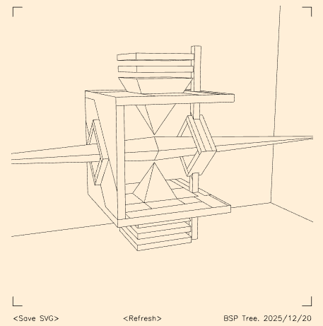

# BSP Hidden Lines — SVG / Plotter friendly

Hidden-line rendering using a classic BSP tree approach  
(archaeological code revival from 90s-era engines).

## Features

- Exact hidden-line removal (no painter’s algorithm)
- BSP-based ray occlusion
- SVG output (pen-plotter friendly)
- Zero fill, pure geometry
- Near-zero allocations in hot paths

## Demo

Open `index.html` locally  
or view [Live demo](https://ge1doot.github.io/bsp-hidden-lines-svg/)

## Origins

Inspired by classic BSP literature:
http://www.gamers.org/dhs/helpdocs/bsp\_faq.html

## Author

Gerard Ferrandez (@ge1doot)

